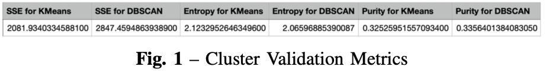

# Data Mining - Artificial Pancreas System

## Project Summary:

The overall objective of the project has been split into four different phases, each one intended towards accomplishing a part of the big picture. The course of the project starts with performance metrics and feature extraction followed by the implementation of classification, clustering, and association rule mining techniques on the given time series data. I was introduced to advanced python programming and machine learning techniques through this course, and the project pro- vided the opportunity to explore and learn how impactful data mining can be in analyzing and extracting useful information from otherwise obscure data.

## Implementation:

The sensor data from the CGM sensor and the Insulin pump of a patient is provided as two different comma separated value (.csv) files, both consisting of the same 47 columns overall. However, the two files are sparse with most of the columns not applicable to the scope of the project.

### Phase 1:
Extraction of CGM performance metrics from raw time-series sensor data.

### Phase 2:
Identify and extract meal and no-meal times with their respective sensor glucose readings followed by extracting features that are discriminatory to one another.

### Phase 3:
Finding patterns in meal data through clustering. Using meal data features extracted in the last phase with an addition of two more features,
1. Maximum slope value of the mealtime curve and 
2. The time taken to reach the maximum insulin value, to perform clustering based on the carbohydrates in each meal.

### Phase 4:
Determine anomalous meal events based on Bolus metrics through Association Rule Mining.

## Lessons Learnt:

The implementation part of this project has introduced me to advanced python programming with libraries like sklearn, pandas, NumPy, mlxtend, and scipy. It has equipped me with the necessary skill set to work on large data files and process them as per requirements. I also learned the implementation of different learning libraries using the processed data.

The conceptual part of the project has helped me learn the importance of data in general and the power of data mining techniques in discovering relationships and patterns in data. I was also introduced to basic signal processing techniques like Fourier and Fast Fourier Transforms in the process of feature extraction. This helped me learn the importance of signal processing knowledge to work with data. Finally, the project provided me the opportunity to explore different industry-standard machine learning techniques that are cur- rently being applied in various domains. I was able to apply the supervised machine learning techniques such as classification and the unsupervised machine learning techniques such as clustering and association rule mining, that I learned in the data mining course and gain valuable practical experience out of it.